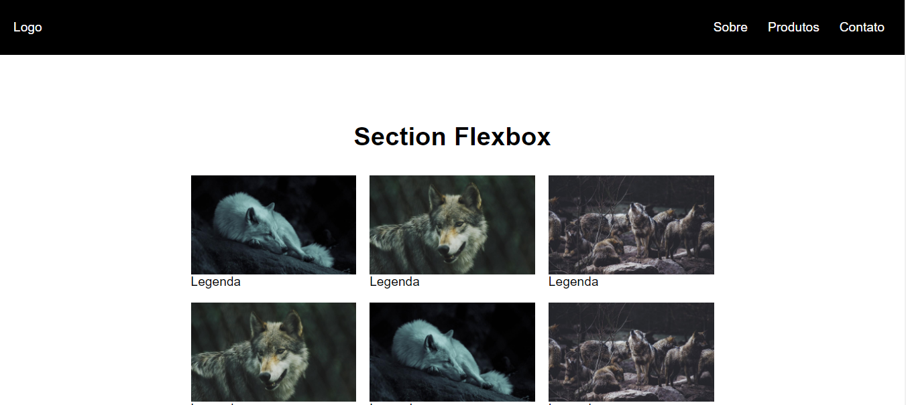
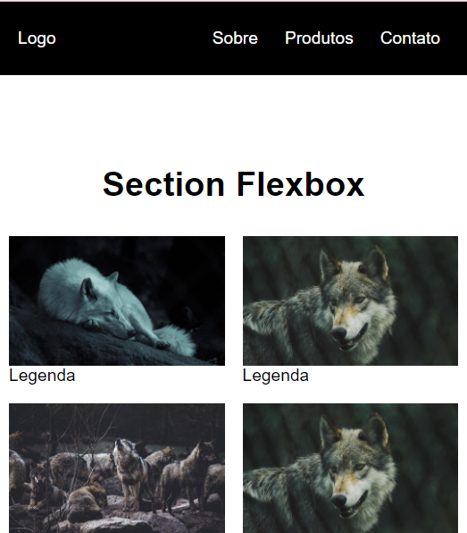

# Flex Box Study

## 📌 About ##
 

 Português:   
    Este projeto é uma tela de loja web responsiva criada usando o Flexbox. Ele foi desenvolvido como parte de um estudo pessoal sobre HTML e CSS, onde o objetivo era explorar as capacidades do Flexbox e do GridLayout. Neste projeto, apenas o Flexbox foi utilizado para organizar e estruturar o layout da tela. A tela apresenta uma interface simples de uma loja online, demonstrando a capacidade do Flexbox em criar layouts responsivos de forma eficiente.

English:  
   This project is a responsive web store screen created using Flexbox. It was developed as part of a personal study on HTML and CSS, aiming to explore the capabilities of Flexbox and GridLayout. In this project, only Flexbox was utilized to organize and structure the layout of the screen. The screen features a simple interface of an online store, demonstrating Flexbox's ability to efficiently create responsive layouts.

## ⚒️ Tools 

- HTML5    
&nbsp;

- CSS3    
&nbsp;

## 💻 Preview <a href="https://pceraa.github.io/flex01/" target="_blank">🔗</a>

## 📃 License 

This project is under the MIT license. See the file [LICENSE](./LICENSE) for more details
